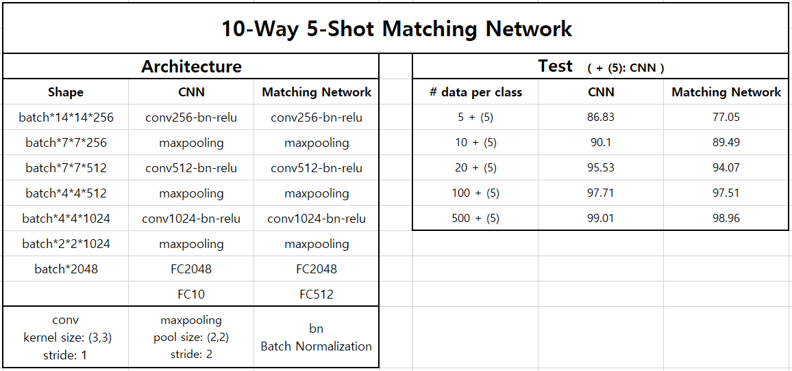

# TensorFlow-Matching_Networks_for_One_Shot_Learning
Matching Networks for One Shot Learning

논문) 적은 수의 데이터로도 딥러닝을 학습할 수 있도록 하는 모델  
논문) A Label을 학습한 Matching Network로 B Label을 재학습 없이도 Test 가능  
==> 추후 실험 진행해보자.

## Paper
https://arxiv.org/abs/1606.04080

## Dataset
MNIST (논문에서는 omniglot, ImageNet 으로 실험되어 있음, 본 코드에서는 MNIST 실험 진행)

## Env
TensorFlow version == 1.4  
GTX-1080TI  

## Matching Network for One Shot Learning Model
논문에서 설명하는 모델  
사용 코드: one_shot_learning_class.py, get_S_B_MNIST.py, train_and_test.py

## CNN Model
Matching Network와 MNIST 분류 정확도 비교를 위한 CNN Model  
사용 코드: cnn.py, get_S_B_MNIST.py

## get_S_B_MNIST.py
class별로 원하는 개수 만큼의 MNIST 데이터를 추출하기 위한 코드

## one_shot_learning_class.py
Matching Network for One Shot Learning Model을 구현한 코드

## train_and_test.py
Matching Network for One Shot Learning Model을 학습하고 테스트 하는 코드.

## MNIST dataset Test Result (CNN vs Matching Network for One Shot Learning)
Matching Network는 10-Way 5-Shot. (way: # classes, shot: # memory data per class)  
CNN의 학습 데이터: Matching Network의 학습 데이터 + shot (CNN은 shot이 필요 없으므로)  
  

